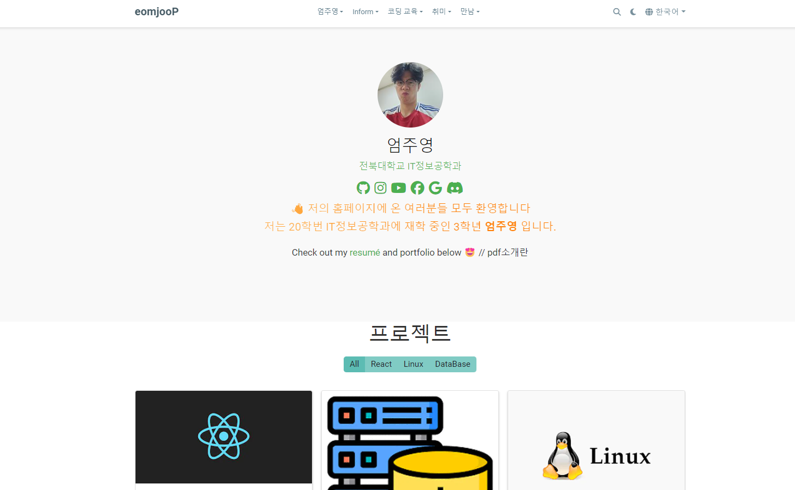

# [휴고를 이용한 정적 웹사이트 만들기](https://github.com/wowchemy/starter-hugo-portfolio-theme)

## 소개
안녕하세요 전북대학교 3학년 IT정보공학과에 재학중인 엄주영입니다. 웹서비스 설계 과제를 통해 휴고를 이용한 정적 웹사이트를 만들어 봤습니다. 저는 백엔드에서 스프링에 관심이  앞으로 스프링을 이용하여 다양한 프로젝트를 경험해볼 예정입니다. 앞으로 잘 지켜봐 주세요! 

## 내용
홈페이지 메인에는 저의 프로젝트 활동, 독서 활동, 코딩 교육에 대한 내용이 있습니다. 메뉴 탭에는 저에 대한 소개 , 알림, 코딩 교육, 저의 취미, 저와의 만남으로 구성되어있습니다. 한번 방문하여 저의 웹사이트를 즐겨보세요! ⭐⭐⭐
👉

❤️❤️❤️❤️❤️❤️❤️❤️❤️❤️❤️❤️❤️❤️❤️❤️❤️❤️❤️❤️❤️❤️❤️❤️❤️❤️❤️❤️❤️❤️❤️❤️❤️❤️❤️❤️❤️❤️❤️❤️❤️❤️❤️❤️❤️❤️❤️❤️❤️❤️❤️❤️❤️❤️
